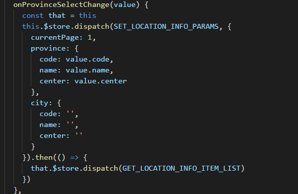
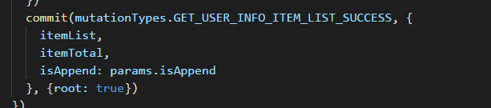
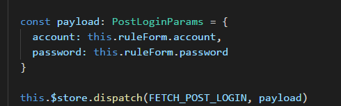
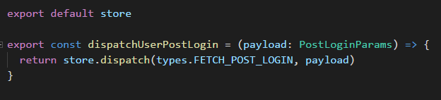
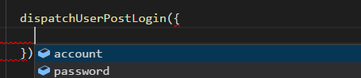

# Vue2.5+ Typescript 引入全面指南 - Vuex篇

# 前言

Vuex 正是我下决心引入Typescript的核心痛点。与 vuex 相关的代码中，到处充斥着此般写法：



此般写法：



再加上vuex的 `dispatch/commit` 并非直接引用代码，而是是通过一个string类型的 `type` 来标记，如此一来上图中写法，如果想查看 `payload` 的具体内容，甚至不能借助于编辑器的查找定义，只能手动去切代码查看！简直苦不堪言。

而借助于 `typescript` 的 `interface` 接口，至少可以简化成如下效果：



这么写一样麻烦，不是还需要记类似PostLoginParams的Interface类型？这简单，建个辅助函数就是：



编辑器里一个 `Ctrl + 空格`，`payload`里有哪些参数就全出来，再也不用去一遍遍翻代码，效率直线提升！



# 现状概述

截至当前2017年11月，Vuex对Typescript的支持，仍十分薄弱，官方库只是添加了一些`.d.ts`声明文件，并没有像`vue 2.5`这样内置支持。

第三方衍生库 `vuex-typescript`, `vuex-ts-decorators`, `vuex-typex`, `vuex-class`等等，我个人的总结，除了`vuex-class`外，基本都存在侵入性太强的问题，引用不算友好。而`vuex-class`提供的功能其实也是薄薄一层，并不能解决核心痛点。因此，需要手动添加辅助的地方，其实颇多。

核心痛点：每次调用`this.$store.dispatch` / `this.$store.commit` / `this.$store.state`/ `this.$store.getters` 都会伴随着类型丢失。

其中，`dispatch/commit` 可以通过建立辅助函数形式，简单绕开。 `state/getters` 没有太好办法，只能手动指定，若觉得麻烦，可以全都指成 `any`，等官方支持。官方动态见此 [issue](https://github.com/vuejs/vuex/issues/564)

# 动手改造第一步：从 shopping-cart 示例搬运代码

>以下示例基于 `vuex` 官方 `examples` 中最复杂的一个 [shopping-cart](https://github.com/vuejs/vuex/tree/dev/examples/shopping-cart)，
改造后的完整代码见[vue-vuex-typescript-demo](https://github.com/qidaizhe11/vue-vuex-typescript-demo)

准备工作：
- `shopping-cart`代码复制至项目目录下
- `.js`文件统一重命名为`.ts`，
- `currency.js`/`api/shop.js`/`components/App.vue`等外围文件的ts改造
- `npm i -D vuex` 添加依赖

详细这里这里略去，参照 [代码库](https://github.com/qidaizhe11/vue-vuex-typescript-demo) 即可

# 动手改造第二步：State改造

用到state变量的地方实在太多，不仅`store`目录下 action/getter/mutation 均有可能需要，甚至在 `.vue` 文件里，`mapState`也有引用，因此我个人总结的一套实践：

- store/modules下的每个子模块，均维护自己名为 State 的 Interface 声明
- store/index.ts 文件中，汇总各子模块，维护一个总的State声明

`store/modules` 下文件举例：

```
// ./src/store/modules/cart.ts

interface Shape {
  id: number
  quantity: number
}

export interface State {
  added: Shape[]
  checkoutStatus: 'successful' | 'failed' | null
}

// initial state
// shape: [{ id, quantity }]
const state: State = {
  added: [],
  checkoutStatus: null
}

// 需引用state的地方举例：

const getters = {
  checkoutStatus: (state: State) => state.checkoutStatus
}

```

`store/index.ts` 文件总State举例：

```
// ./src/store/index.ts

import { State as CardState } from './modules/cart'
import { State as ProductsState } from './modules/products'

export interface State {
  cart: CardState,
  products: ProductsState
}

```

总 `State` 引用示例：

```
// ./src/store/getters.ts

import { State } from './index'

const cartProducts: Getter<State, any> = (state: State) => {
  return state.cart.added.map(shape => {
    // 此处shape自动推导出Shape类型
    // ... 详见源码
  })
}

```

如此，所有直接引用 `state` 的地方，均可启用类型推导

# 动手改造之 Mutation

`Mutation` 对应 `store.commit` 命令，常见写法：

```
const mutations = {
  [types.ADD_TO_CART] (state, { id }) {
    // ...
  }
}
```

state 上步已处理`{ id }`，`payload` 参数，即为开篇介绍类型缺失的重灾区。

我的一套个人实践：

- `store/modules` 下的子模块文件，为自己的`mutations` 维护 payload Interface声明
- 子模块共用 payload（多个模块响应同一 commit 等），在 `store/index.ts` 中统一维护
- 新建文件 `store/dispatches.ts` 文件，为每一个直接调用的带参`commit`维护辅助函数，以应用类型推导

子模块 `payload` 声明举例：

```
// ./src/store/modules/products.ts

import { Product, AddToCartPayload } from '../index'

export interface ProductsPayload {
  products: Product[]
}

const mutations = {
  [types.RECEIVE_PRODUCTS] (state: State, payload: ProductsPayload) {
    state.all = payload.products
  },

  [types.ADD_TO_CART] (state: State, payload: AddToCartPayload) {
    const product = state.all.find(p => p.id === payload.id)
    // ...
  }
}

// mutations调用举例：
const actions = {
  getAllProducts (context: ActionContextBasic) {
    shop.getProducts((products: Product[]) => {
      const payload: ProductsPayload = {
        products
      }
      context.commit(types.RECEIVE_PRODUCTS, payload)
    })
  }
}

```

`store/index.ts`文件公共 `payload` 声明举例：

```
// ./src/store/index.ts

export interface AddToCartPayload {
  id: number
}
```

`store/dispatches.ts`文件，`commit`辅助函数，参见下步同文件`dispatch`辅助函数

# 动手改造之 Action

`Action` 对应 `store.dispatch` 命令，常见写法：

```
const actions = {
  checkout ({ commit, state }, products) {
    // ...
  }
}
```

其中第二个参数`products`，`payload` 参数，用法同上步 `Mutation` 的 `payload` 参数，不再赘述。

第一个参数`{ commit, state }`，`context`参数，`vuex` 的 `d.ts` 提供有类型 `ActionContext`，用法如下：

```
import { ActionContext } from 'vuex'
const actions = {
  checkout (context: ActionContext<State, any>, products: CartProduct[]) {
    context.commit(types.CHECKOUT_REQUEST)
    // ...
  }
}
```

`ActionContext<State, RootState>` 传入两个大部分Action根本用不到的参数，才能得到需要的`dispatch`, `commit`，在我看来，难用至极。

个人更喜欢如下写法：
```
const actions = {
  checkout (context: { commit: Commit, state: State }, products: CartProduct[]) {
    context.commit(types.CHECKOUT_REQUEST)
    // ...
  }
}
```

`Action` payload 改造参见步骤 `Mutation`，不再赘述。

`store/dispatches.ts`文件，`dispatch`辅助函数：

```
// ./src/store/dispatches.ts

import store, { CartProduct, Product } from './index'

export const dispatchCheckout = (products: CartProduct[]) => {
  return store.dispatch('checkout', products)
}
```

`.vue`文件调用举例：

```
// ./src/components/Cart.vue

import { dispatchCheckout } from '../store/dispatches'
export default Vue.extend({
  methods: {
    checkout (products: CartProduct[]) {
    // this.$store.dispatch 写法可用，但不带类型推导
    // this.$store.dispatch('checkout', products)
    dispatchCheckout(products) // 带有类型智能提示
    }
  }
})
```

# 动手改造之 Getter

`Getter`常见写法：

```
const getters = {
  checkoutStatus: state => state.checkoutStatus
}
```

需要改的不多，state 加上声明即可：
```
const getters = {
  checkoutStatus: (state: State) => state.checkoutStatus
}
```

# 动手改造之独立的 Mutations/Actions/Getters 文件

独立文件常规写法：
```
// ./src/store/getters.js
export const cartProducts = state => {
  return state.cart.added.map(({ id, quantity }) => {
    const product = state.products.all.find(p => p.id === id)
    return {
      title: product.title,
      price: product.price,
      quantity
    }
  })
}
```

引用：
```
// ./src/store/index.js

import * as getters from './getters'
export default new Vuex.Store({
  getters
})
```

`typescript`下均需改造：

```
// ./src/
import { GetterTree, Getter } from 'vuex'
import { State } from './index'

const cartProducts: Getter<State, any> = (state: State) => {
  return state.cart.added.map(shape => {
    // ...
  })
}

const getterTree: GetterTree<State, any> = {
  cartProducts
}

export default getterTree
```

> Actions/Mutations 文件改造同上，类型换成 ActionTree, Action, MutationTree, Mutation即可

引用：
```
// ./src/store/index.js

import getters from './getters'
export default new Vuex.Store({
  getters
})
```

原因是`vuex`定义，`new Vuex.Store`参数类型 StoreOptions 如下：
```
export interface StoreOptions<S> {
  state?: S;
  getters?: GetterTree<S, S>;
  actions?: ActionTree<S, S>;
  mutations?: MutationTree<S>;
  modules?: ModuleTree<S>;
  plugins?: Plugin<S>[];
  strict?: boolean;
}
```

于是，独立Gettes/Actions/Mutations文件，export 必须是GetterTree/ActionTree/MutationTree类型

# 动手改造之 .vue 文件调用

- 传统写法全部兼容，只需 `mapState`为state添加类型 (state: State) => state.balabal 等很少改动即可正常运行。只是类型均为 `any`

- 建议不使用 `mapState` / `mapGetters` / `mapActions` / `mapMutations`，以明确指定类型

- `dispatch` 及 `commit` 调用可通过上述 `store/dispatches.ts` 下辅助函数，手动开启类型推导

- `state` 及 `getters` 类型推导，暂时只能手动指定。自动推导，估计得等官方内置支持了。

完整调用示例：

```
// ./src/components/ProductList.vue

import Vue from 'vue'
// import { mapGetters, mapActions } from 'vuex'
import { Product } from '../store'
import { dispatchAddToCart } from '../store/dispatches'

export default Vue.extend({
  computed: {
    // ...mapGetters({
    //   products: 'allProducts'
    // })
    products (): Product[] {
      return this.$store.getters.allProducts
    }
  },
  methods: {
    // ...mapActions([
    //   'addToCart'
    // ])
    addToCart (p: Product) {
      dispatchAddToCart(p)
    }
  },
  created () {
    this.$store.dispatch('getAllProducts')
  }
})
```

# vue-class-component + vuex-class 组件式写法

如果觉得以上废弃 `mapState` / `mapGetters` 后的写法繁琐，可引入`vue-class-component` + `vuex-class`，开启组件式写法

- `vue-class-component`，vue官方维护，学习成本低
- `vuex-class`，作者 `ktsn`，vuex及vue-class-component贡献排第二（第一尤雨溪了）的活跃开发者，质量还是有保障的

引入这俩依赖后，须在 `tsconfig.json` 添加配置：

```
{
  "compilerOptions": {
    // 启用 vue-class-component 及 vuex-class 需要开启此选项
    "experimentalDecorators": true,

    // 启用 vuex-class 需要开启此选项
    "strictFunctionTypes": false
  }
}
```

`Component` 写法示例：

```
import Vue from 'vue'
import { Product } from '../store'
// import { dispatchAddToCart } from '../store/dispatches'
import Component from 'vue-class-component'
import { Getter, Action } from 'vuex-class'

@Component
export default class Cart extends Vue {
  @Getter('cartProducts') products: CartProduct[]
  @Getter('checkoutStatus') checkoutStatus: CheckoutStatus
  @Action('checkout') actionCheckout: Function

  get total (): number {
    return this.products.reduce((total, p) => {
      return total + p.price * p.quantity
    }, 0)
  }

  checkout (products: CartProduct[]) {
    // dispatchCheckout(products)
    this.actionCheckout(products)
  }
}
```

# 完整代码

Github：https://github.com/qidaizhe11/vue-vuex-typescript-demo
