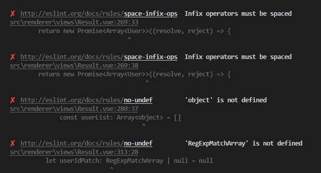
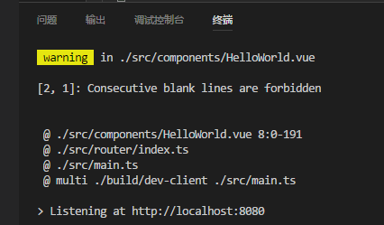

# Vue2.5+ Typescript 引入全面指南

# 写在前面

写这篇文章时的我，Vue使用经验三个多月，Typescript完全空白，
花了大概三个晚上把手头项目迁移至Typescript，因此这篇文章更像个入门指引。

# 总原则

两大原则：

## 最小依赖引入
---

由于我个人从Javascript到Typescript的升级，更倾向于平滑顺移，因此，我对新依赖的引入整体保持克制原则，只引入了必要项，以尽量贴近原生vue写法：
- `typescript`
- `ts-loader`

以下依赖均未引入：
- `vue-class-component`：官方维护，学习成本小，但与`vuex`融合性极差，计划等官方完善对`vuex`支持后再考虑引入
- `vue-property-decorator`：非官方维护，一定学习成本
- `vuex-class`：非官方维护，在`vue-class-component`基础上补充一定`vuex`支持（支持有限）
- `vuex-ts-decorators`/`vuex-typescript`等：非官方维护，学习成本极高

> PS: 后总结，vue官方维护的 vue-class-component 还是很有必要引入的，文末有详细说明。

> PS: `tslint-loader`由于对`vue`的支持尚不完美，作为可选项文末有详细说明。

## 既然用了 Typescript，不到万不得已不用 any!
---

any 任意类型的存在，在我看来就是个潘多拉魔盒，一旦开启，很容易养成偷懒的习惯，碰到难题就上any。因此，我的建议是，尽量不要去碰它，除非你无路可走。

# Vue-cli 生成项目启用 Typescript

> 注：这里只介绍Webpack模板下使用。

`vue init webpack <项目名称>`生成的项目需做如下改动以兼容Typescript:

## 依赖安装

`npm i --save typescript ts-loader` 安装必要依赖。推荐使用`cnpm`。

## Webpack 配置

`./build/webpack.base.conf.js`，作如下改动：

- entry入口文件`main.js`改为`main.ts`：
```
entry: {
  app: './src/main.ts'
}
```

- `resolve.extensions`添加`.ts`：
```
resolve: {
  extensions: ['.js', '.ts', '.vue', '.json']
}
```

- `module.rules`添加`.ts`解析规则：
```
module: {
  rules: [
    {
      test: /\.tsx?$/,
      loader: 'ts-loader',
      exclude: /node_modules/,
      options: {
        appendTsSuffixTo: [/\.vue$/]
      }
    }
  ]
}
```

## tsconfig.json

项目根路径下添加文件`tsconfig.json`，官方推荐配置如下：
```
// tsconfig.json
{
  "compilerOptions": {
    // 与 Vue 的浏览器支持保持一致
    "target": "es5",
    // 这可以对 `this` 上的数据属性进行更严格的推断
    "strict": true,
    // 如果使用 webpack 2+ 或 rollup，可以利用 tree-shake:
    "module": "es2015",
    "moduleResolution": "node"
  }
}
```

## vue-shim.d.ts

`src`目录下添加文件`vue-shim.d.ts`：
```
declare module "*.vue" {
  import Vue from "vue";
  export default Vue;
}
```

意思是告诉TypeScript `*.vue`后缀的文件可以交给`vue`模块来处理。

## .js 文件重命名为 .ts 文件

从`src/main.js`开始，包括`src/router/index.js`等逐一从`.js`重命名为`.ts`

> 注意：重命名后对`vue`文件的`import`，需添加`.vue`后缀

因为Typescript默认只识别`*.ts`文件，不识别`*.vue`文件

之前：

```
import App from './App'
import HelloWorld from '@/components/HelloWorld'
```

需改为：
```
import App from './App.vue'
import HelloWorld from '@/components/HelloWorld.vue'
```

## .vue 文件改造

要点：
* `<script>`标签添加`lang="ts"`声明
* 使用`Vue.extend`定义组件

示例：
```
// src/components/HelloWorld.vue
<script lang="ts">
import Vue from 'vue'
export default Vue.extend({
  name: 'HelloWorld',
  data () {
    return {
      msg: 'Welcome to Your Vue.js App'
    }
  }
})
</script>
```

## npm run dev

至此运行项目，即可正常运行，vue对typescript的初步引入，基本完成。

# TSLint

总结：
当前（2017年11月），对`.vue`文件，可以在关闭`no-consecutive-blank-lines`检查前提下，开启构建时`TSLint`支持，至于VSCode编辑器的编辑时提示，完全没有。

详见TSLint的 [issue](https://github.com/palantir/tslint/issues/2099) 及vetur的 [issue](https://github.com/vuejs/vetur/issues/170)

不幸的是，也不能拿`ESLint`将就用，不然一堆如下的Error等着你：


所以，只剩俩选择，要么关了，要么按照下面的配置将就着用：

- 添加依赖

```
npm i --save-dev tslint tslint-loader tslint-config-standard
```

- `module.rules`移除`eslint-loader`，添加`tslint-loader`预处理
```
// ./build/webpack.base.conf.js
module: {
  rules: [
    // {
    //   test: /\.(js|vue)$/,
    //   enforce: 'pre',
    //   exclude: /node_modules/,
    //   use: {
    //     loader: 'eslint-loader',
    //     options: {
    //       formatter: require('eslint-friendly-formatter')
    //     }
    //   }
    // },
    {
      test: /\.ts$/,
      exclude: /node_modules/,
      enforce: 'pre',
      loader: 'tslint-loader'
    },
    {
      test: /\.vue$/,
      loader: 'vue-loader',
      options: vueLoaderConfig
    },
  ]
}
```

- `vue-loader`中开启`tslint-loader`选项：

```
// ./build/vue-loader.conf.js

const merge = require('webpack-merge')

module.exports = {
  loaders: merge(utils.cssLoaders({
      sourceMap: isProduction
        ? config.build.productionSourceMap
        : config.dev.cssSourceMap,
      extract: isProduction
    }), {
      ts: ['ts-loader', 'tslint-loader']
    }
  ),
  ... // 其他内容
}
```

- 项目根路径下添加文件`tslint.json`：
```
// tslint.json
{
  "extends": "tslint-config-standard",
  "globals": {
    "require": true
  },
  "rules": {
    "no-consecutive-blank-lines": false
  }
}
```

`no-consecutive-blank-lines`关闭的解释：[here](https://github.com/palantir/tslint/issues/2099#issuecomment-293972671)

简单翻译，`vue-loader`与`tslint-loader`结合使用，就像是把.vue文件里的`<template>`与`<style>`等非js内容全部置为了空行一样，为此，只能关闭此检查。

重新运行`npm run dev`，即可看到构建时可能输出的`eslint`警告（eslint默认级别warning，不阻断构建，如需error级别，可自行修改）



# vue-class-component的必要性

原生vue组件写法会导致一很烦的问题：

`data()`如果如下形式定义数组，将会被推导为`[]never`类型:

```
export default Vue.extend({
  data () {
    return {
      list: []  // type: []never
    }
  }
})
```

这样一来，此`array`直接废掉，因为不能往上附加值，只能如此提前声明：

```
export default Vue.extend({
  data () {
    const list: string[] = []
    return {
      list: list
    }
  }
})
```

而引入`vue-class-component`后的`class`写法，则可以一行搞定：

```
<script lang="ts">
import Vue from 'vue'
import Component from 'vue-class-component'

@Component
export default class HelloWorld extends Vue {
  list: string[] = []

  hello () {
    list.push('Hello world')
  }
}
</script>
```

我个人是考虑到 `vue-class-component` 对 `vuex` 的 `mapState`, `mapGetters` 等函数支持较差，（可以借助`vuex-class`引用），再加`Decorators`并不是我对typescript的核心需求（`Interface`才是！），决定的暂缓引入，先不增加复杂度。

# Vuex

有待补充。
